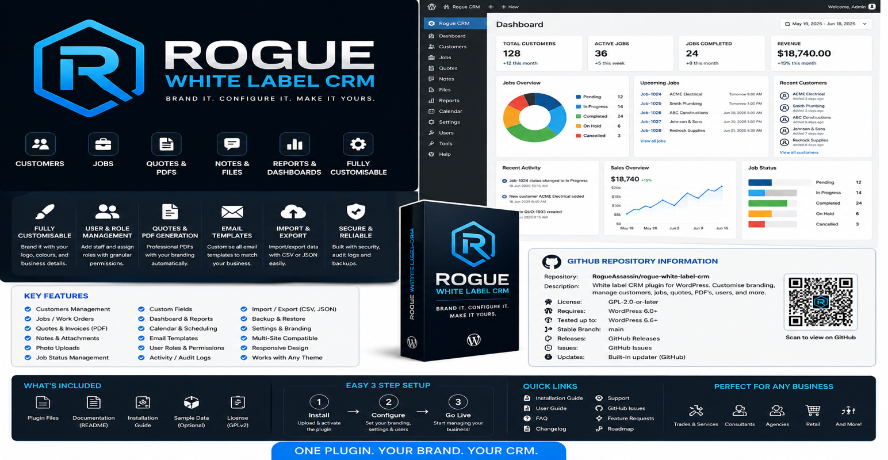

# Rogue White Label CRM



**Rogue White Label CRM** is a reusable white-label CRM plugin for WordPress. It gives a business a simple admin CRM for customers, jobs, configurable job statuses, exports, staff roles, and branding settings without locking the plugin to one company name.

Repository: `github.com/RogueAssassin/rogue-white-label-crm`

---

## What it does

Rogue White Label CRM adds a dedicated CRM area inside WordPress Admin.

The plugin is designed so a site owner can install it, add their own business name and settings, create their own users, and start managing customers and jobs without editing PHP files.

---

## Features included in v1.0.0

- White-label CRM dashboard
- Customer management
- Job management
- Job delete function
- Customer delete function
- Configurable job number prefix
- Configurable job statuses
- Business branding settings
- Currency symbol setting
- CRM Manager role
- CRM Staff role
- CSV customer export
- CSV job export
- WordPress admin styling
- GitHub release assets
- Installation and configuration documentation

---

## Plugin folder name

The plugin folder must remain:

```text
rogue-white-label-crm
```

Do not add the version number to the folder name. This keeps future updates cleaner and prevents WordPress from treating each version as a separate plugin.

---

## Installation

1. Download the latest ZIP from GitHub Releases.
2. In WordPress Admin, open **Plugins → Add New → Upload Plugin**.
3. Upload `rogue-white-label-crm.zip`.
4. Activate **Rogue White Label CRM**.
5. Open **Rogue CRM → Settings**.
6. Configure the business name, contact details, colours, currency, job prefix, and job statuses.

---

## First-time configuration

After activation, go to **Rogue CRM → Settings** and update these fields.

### Business settings

- Business Name
- Business Email
- Business Phone
- Website

### Branding settings

- Primary Colour
- Secondary Colour

### CRM settings

- Currency Symbol
- Job Prefix
- Job Statuses
- PDF / Quote Terms

---

## Job numbering

The plugin automatically generates job numbers using your configured prefix.

Examples:

```text
JOB-0001
CASE-0001
WORK-0001
QUOTE-0001
```

To change this, update **Rogue CRM → Settings → Job Prefix**.

---

## Job statuses

Statuses are fully configurable.

Default statuses:

```text
Pending
Booked
In Progress
Completed
Cancelled
```

Example custom workflow:

```text
New Request
Awaiting Quote Approval
Booked
In Progress
Awaiting Customer
Ready to Invoice
Completed
Cancelled
```

Enter one status per line in **Rogue CRM → Settings**.

---

## User roles

The plugin creates two CRM roles.

### CRM Manager

Can manage CRM records.

Recommended for:

- Business owners
- Managers
- Office administrators

### CRM Staff

Can view CRM records.

Recommended for:

- Technicians
- Contractors
- Read-only staff

WordPress Administrators automatically receive CRM management permissions.

---

## Adding users

1. Go to **Users → Add New**.
2. Enter the user's name and email.
3. Choose either **CRM Manager** or **CRM Staff**.
4. Save the user.

---

## Exporting data

Customers and jobs can be exported as CSV files.

Open:

- **Rogue CRM → Customers → Export CSV**
- **Rogue CRM → Jobs → Export CSV**

---

## GitHub repository setup

Recommended repository:

```text
https://github.com/RogueAssassin/rogue-white-label-crm
```

Suggested GitHub description:

```text
White-label WordPress CRM plugin for customers, jobs, branding, staff roles, exports, and configurable workflows.
```

Suggested topics:

```text
wordpress-plugin crm white-label customer-management job-management php wordpress rogueassassin
```

Suggested release tag:

```text
v1.0.0
```

Release ZIP:

```text
rogue-white-label-crm.zip
```

---

## Release graphic

The GitHub release/social preview graphic is included here:

```text
assets/images/github-social-preview.png
```

Logo asset:

```text
assets/images/rogue-white-label-crm-logo.png
```

Banner asset:

```text
assets/images/banner-1544x800.png
```

---

## Roadmap ideas

Future versions can add:

- Logo uploader field
- PDF generation using Dompdf when available
- Email template editor
- Notes and attachments UI
- Calendar view
- Quote and invoice modules
- Import tools
- Backup and restore tools
- GitHub updater integration
- Activity/audit log
- Custom fields manager
- Module enable/disable settings

---

## Safety note

The uninstall file intentionally preserves CRM database tables. This avoids accidental loss of customer or job data if the plugin is deleted by mistake.

---

## Developer notes

Main plugin file:

```text
rogue-white-label-crm.php
```

Important classes:

```text
includes/class-installer.php
includes/class-settings.php
includes/class-admin.php
includes/class-crud.php
includes/class-export.php
```

Database tables:

```text
wp_rwlc_customers
wp_rwlc_jobs
wp_rwlc_notes
```

The table prefix changes depending on the WordPress install prefix.

---

## License

GPL-2.0-or-later.
